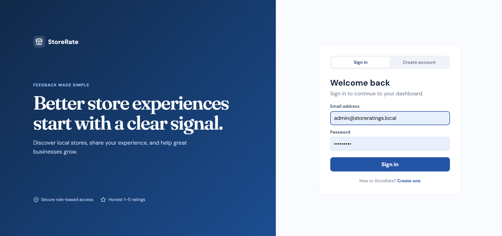
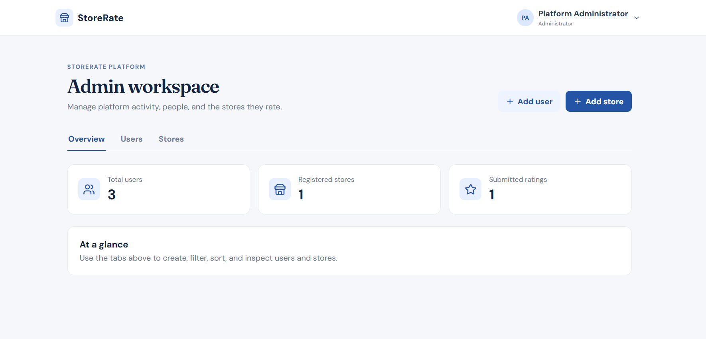
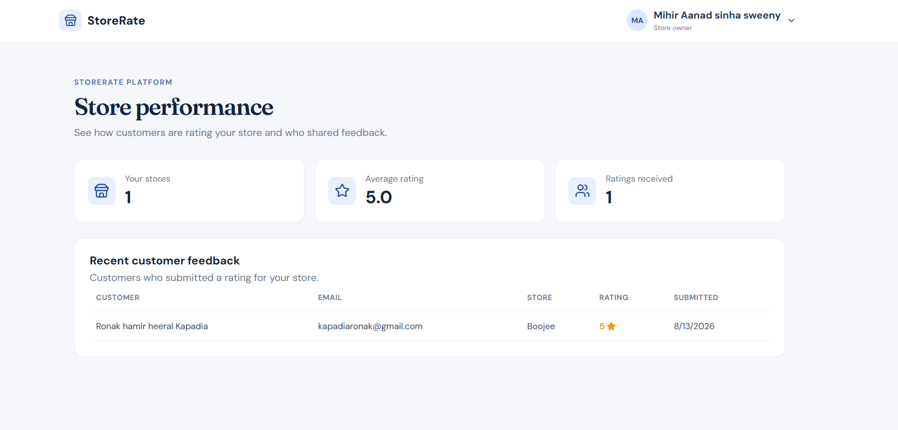

# StoreRate

> A full-stack, role-based store rating platform built for the Roxiler Systems FullStack Intern Coding Challenge.

StoreRate enables customers to discover registered stores and submit ratings, while administrators manage the platform and store owners track feedback for their stores. The project focuses on clear role boundaries, secure authentication, practical validation, and a polished responsive interface.

## Product Preview

| Sign in | Administrator workspace |
| --- | --- |
|  |  |

### Store Owner Dashboard



## Highlights

- Three role-specific experiences: **System Administrator**, **Normal User**, and **Store Owner**
- Secure JWT authentication with bcrypt password hashing
- Customer signup, searchable store directory, and editable 1–5 star ratings
- Administrator dashboard with total users, stores, and submitted-rating metrics
- Store and user management, user detail view, list filters, and sortable tables
- Store-owner dashboard with average rating and customer feedback history
- Client and server-side validation for all required challenge rules
- Responsive, professional UI designed for desktop and smaller screens

## Tech Stack

| Layer | Technology |
| --- | --- |
| Frontend | React, Vite, Lucide icons, CSS |
| Backend | Node.js, Express |
| Database | MySQL, Sequelize ORM |
| Authentication | JSON Web Tokens, bcryptjs |

## Role Capabilities

| Role | What they can do |
| --- | --- |
| System Administrator | View platform metrics; create users and stores; filter/sort user lists; sort store lists; view user details and store-owner ratings |
| Normal User | Register, sign in, change password, search stores by name/address, submit or modify a 1–5 rating |
| Store Owner | Sign in, change password, view their stores’ average rating, and see customers who left ratings |

## Validation Rules

The app follows the brief’s validation requirements on both the frontend and backend.

| Field | Rule |
| --- | --- |
| Name | 20–60 characters |
| Email | Standard email format |
| Address | Up to 400 characters |
| Password | 8–16 characters, including one uppercase letter and one special character |
| Rating | Whole number from 1 to 5 |

## Local Setup

### Prerequisites

- Node.js 18+
- MySQL (XAMPP MySQL also works)

### 1. Create the database

```sql
CREATE DATABASE store_ratings;
```

### 2. Configure environment variables

Copy `.env.example` to `server/.env`, then update the database credentials if necessary:

```env
PORT=4000
CLIENT_URL=http://localhost:5173
JWT_SECRET=replace-with-a-long-random-secret
DB_HOST=localhost
DB_PORT=3306
DB_NAME=store_ratings
DB_USER=root
DB_PASSWORD=
ADMIN_NAME=Platform Administrator
ADMIN_EMAIL=admin@storeratings.local
ADMIN_PASSWORD=Admin@123
```

### 3. Install and run

```bash
npm run install:all
npm run dev
```

Open [http://localhost:5173](http://localhost:5173).

The backend creates the schema and initial administrator automatically on first run.

## Demo Administrator

| Email | Password |
| --- | --- |
| `admin@storeratings.local` | `Admin@123` |

Use the administrator account to create a store owner, a customer, and stores. Then log in with each role to demonstrate the full role-based workflow.

## API Overview

| Area | Endpoints |
| --- | --- |
| Authentication | `POST /api/auth/signup`, `POST /api/auth/login`, `GET /api/auth/me`, `PATCH /api/auth/password` |
| Stores & ratings | `GET /api/stores`, `PUT /api/stores/:id/rating` |
| Administrator | `GET /api/admin/summary`, `GET/POST /api/admin/users`, `GET /api/admin/users/:id`, `POST /api/admin/stores` |
| Store owner | `GET /api/owner/dashboard` |

## Project Structure

```text
.
├── client/                 # React + Vite application
│   └── src/
│       ├── main.jsx        # Role-based UI and API integration
│       └── styles.css      # Responsive visual system
├── server/
│   └── src/
│       ├── index.js        # Express routes, auth, validation
│       └── models.js       # Sequelize models and relationships
├── .env.example
└── package.json
```

## Design and Engineering Notes

- The rating table prevents duplicate ratings with a unique `(userId, storeId)` constraint; customers update their existing rating instead.
- Protected routes enforce role access in the API, not only the UI.
- Database indexes cover common search and filter fields such as name, email, address, and role.
- No real credentials are committed. Use `server/.env` locally; it is ignored by Git.

---

Built independently for the Roxiler Systems Campus Process Coding Challenge.
